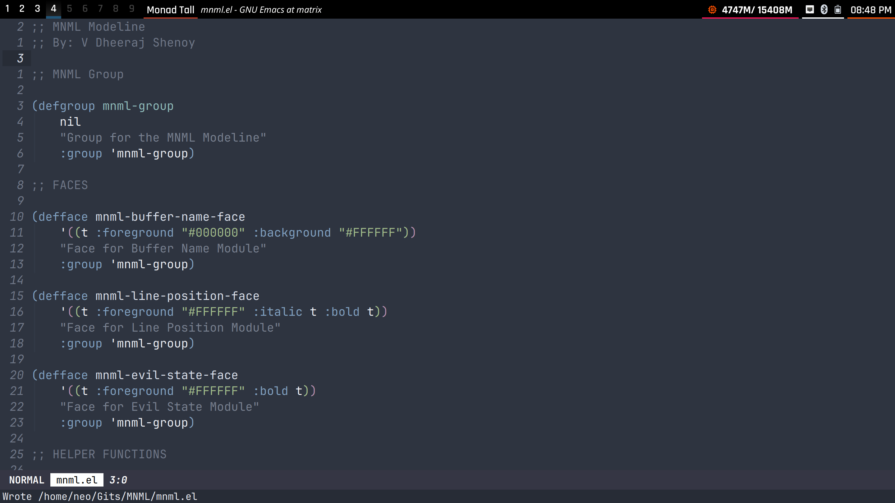

# MNML
A very minimal custom emacs modeline written in Elisp for Emacs.

# Modules

* EVIL Vim State
* File Name
* Line Position

# Why ?

Wanted to learn elisp and also wanted to make my modeline MNML `:)`

# How does it look ?

# TODO

* Add proper padding settings to the modeline
* Add right aligned items
* Spaceous padding also, maybe ?
* Extra Modules

# References

* [Basic modeline beautification](https://www.gonsie.com/blorg/modeline.html)
* [Protesilaous Custom Modeline Tutorial](https://www.youtube.com/watch?v=Qf_DLPIA9Cs)
