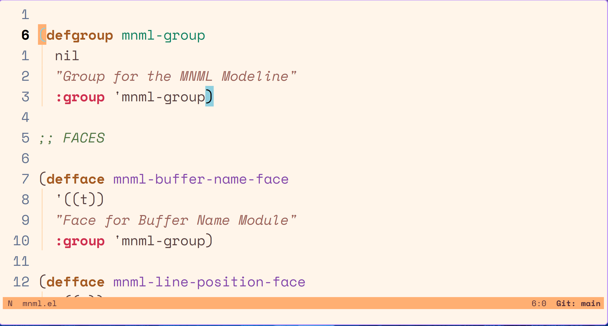

# MNML
A very minimal custom emacs modeline written in Elisp for Emacs.

# Modules

* EVIL Vim State
* File Name
* Line Position
* Version Control Branch

# Why ?

Wanted to learn elisp and also wanted to make my modeline MNML `:)`

# Installation

Clone this repository to some folder and then add the following line of code in your emacs configuration file:

```elisp
(use-package mnml
  :load-path <MNML-directory> ;; MNML-directory is the path to the cloned directory
  :ensure nil
  :custom
  (mnml-evil-state-minimal t))
```

# Screenshot



MNML colors depend on the theme that is currently in use. The images above were taken with the  `ef-day` theme from the [ef-themes](https://github.com/protesilaos/ef-themes) package

# TODO

* [x] Add proper padding settings to the modeline
* [x] Add right aligned items
* [x] Spaceous padding also, maybe ?
* [ ] Extra Modules
* [ ] Hover events

# References

* [Basic modeline beautification](https://www.gonsie.com/blorg/modeline.html)
* [Protesilaous Custom Modeline Tutorial](https://www.youtube.com/watch?v=Qf_DLPIA9Cs)
